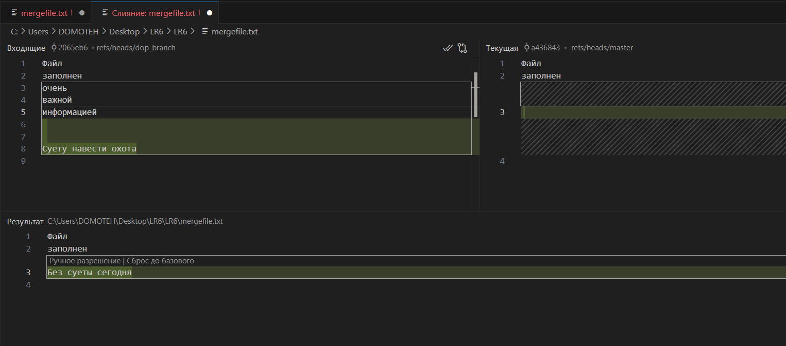

# Лабораторная работа №6: Система контроля версий

**Студент:** Колоскова Полина

**Группа:** 4314

## Описание работы

Цель лабораторной работы: изучение базовых возможностей системы
управления версиями, опыт работы с Git Api, опыт работы с локальным и
удаленным репозиторием.

## Лог всех команд лабораторной работы
```bash
git config --global user.name "4314 Колоскова П.А."
git config --global user.email pkoloskova00@gmail.com
```
```bash
git clone https://github.com/Poitami/LR6.git
```
```bash
git pull
```
```bash
git checkout -b dop_branch
```
```bash
git add mergefile.txt
```
```bash
git commit -m " "
```
```bash
git log
```
```bash
git log -p -1
```
```bash
git checkout master
```
```bash
git merge dop_branch
```
```bash
git branch -a
```
```bash
git branch -d dop_branch
```
```bash
git log --oneline
```
```bash
git revert 1067f64
```
```bash
git log --pretty=format:"%h - %ad - %an - %s" --date=format:"%d.%m.%Y %H:%M:%S"
```

## Форк репозитория LR6
1. Переходим на страницу репозитория [LR6](https://github.com/Kurtyanik/LR6)

2. Нажимаем кнопку "Fork" в правом верхнем углу страницы.


## Установка Git
1. Скачиваем установщик Git с [официального сайта](https://git-scm.com/).

2. Запускаем установщик и следуем инструкциям.

3. Настраиваем имя пользователя и email:


## Клонирование репозитория
1. Клонируем репозиторий на локальную машину:


## Добавление файла через интерфейс GitHub и подтягивание изменений
1. Нажатием кнопки "Add file" -> "Upload files" добавляем новый файл в репозиторий.


2. Подтягиваем изменения на локальную машину:


## Заполнение дополнительной ветки
1. Создаём новую ветку и переходим на неё


2. Производим изменения в файле для последущей возможности конфликта


## История операций для каждой из веток
1. Получаем историю коммитов для дополнительной ветки


2. Получаем историю коммитов для основной ветки


## Просмотр последних изменений
1. Для просмотра изменений последнего коммита выполнено:


## Работа с конфликтом
1. Добавляем изменения в основной ветке, коммитим их и начинаем слияние с дополнительной веткой, где возникает конфликт.


2. Разрешение конфликта в файле [merge.txt](mergefile.txt) при помощи "Завершения слияния" в VSCode.


3. Результат разрешения конфликта и вид истории основной ветки после слияния


## Удаление побочной ветки после успешного слияния
1. Убеждаемся, что находимся в ветке `master`.

2. Удаляем локальную ветку:


## Откат коммита
1. Получаем историю коммитов:


2. Отмена коммита, добавляющего else.txt, при помощи revert:


## Создание ветки для отчёта
1. Создана новая ветка report с переключением на неё:


2. Перенесла все изображения в папку [assets](assets/).

## История операций в отчёте
1. Получила историю коммитов в форматированном виде и добавила её в отчёт:


## Выводы
В ходе выполнения лабораторной работы №6 освоены основные команды Git и приобретены навыки работы с удалёнными репозиториями на GitHub. Изучены процессы форкования, клонирования, коммитинга, слияния веток, разрешения конфликтов и отката коммитов. Также получен опыт использования графических инструментов, таких как VSCode, для управления версиями.
